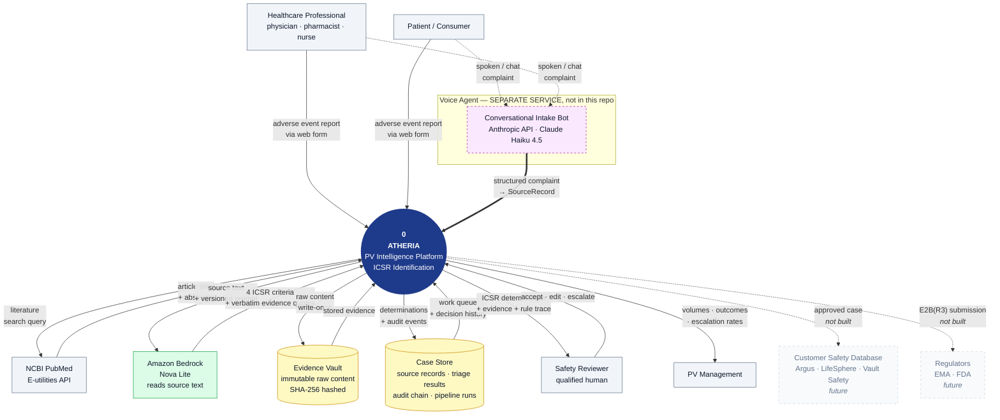

# Atheria — Level 0 Context Diagram

A Level 0 (context) diagram treats the whole platform as a **single process** and
shows only what crosses its boundary: who sends data in, what external services
it depends on, who consumes its output, and what it stores.

For the internal breakdown, see [ARCHITECTURE.md](ARCHITECTURE.md). For the
engineering detail, see [HANDOVER.md](HANDOVER.md).

---

## Scope note: what is and is not in this repository

| Component | In this repo? | Model / provider |
|---|---|---|
| Web form intake | **Yes** | — |
| PubMed literature intake | **Yes** | — |
| Triage + validity rules | **Yes** | Amazon Bedrock, Nova Lite |
| Reviewer inbox | **Yes** | — |
| **Voice agent** (conversational complaint capture) | **No — separate service** | Anthropic API, Claude Haiku 4.5 |
| Email intake | **No — planned** | — |

The voice agent is a **separate deployment** that calls the Anthropic API
directly rather than going through this codebase's Bedrock provider layer. It is
shown in the diagram because it is a real intake channel from the platform's
point of view, but it is drawn with a dashed boundary to make its separateness
explicit. It reaches Atheria the same way any other channel does: by producing a
`SourceRecord` through an intake endpoint.

---

## Level 0 diagram



---

## The same diagram in plain text

For anywhere Mermaid does not render.

```
                    DATA SOURCES                                    CONSUMERS
  ┌──────────────────────────────────────┐              ┌──────────────────────────┐
  │                                      │              │                          │
  │  ┌────────────────────────┐          │              │   ┌──────────────────┐   │
  │  │ Healthcare Professional│──┐       │              │   │ Safety Reviewer  │   │
  │  │ physician · pharmacist │  │       │              │   │ qualified human  │   │
  │  └────────────────────────┘  │       │              │   └────────▲─────────┘   │
  │                              │       │              │            │             │
  │  ┌────────────────────────┐  │       │              │   determination +        │
  │  │ Patient / Consumer     │──┤       │              │   evidence + rule trace  │
  │  └────────────────────────┘  │       │              │            │             │
  │                              │       │              │   ┌────────┴─────────┐   │
  │  ╔══════════════════════════╗│       │              │   │ PV Management    │   │
  │  ║ VOICE AGENT (separate)   ║│       │              │   │ volumes/outcomes │   │
  │  ║ Anthropic · Haiku 4.5    ║├───────┤              │   └──────────────────┘   │
  │  ║ conversational capture   ║│       │              └──────────▲───────────────┘
  │  ╚══════════════════════════╝│       │                         │
  │                              │       │                         │
  │  ┌────────────────────────┐  │       │                         │
  │  │ NCBI PubMed E-utilities│◄─┤       │                         │
  │  │ titles + abstracts     │──┘       │                         │
  │  └────────────────────────┘          │                         │
  └───────────────┬──────────────────────┘                         │
                  │ reports / articles                             │
                  │ (all become SourceRecords)                     │
                  ▼                                                │
      ╔═══════════════════════════════════════════════════╗         │
      ║                        0                          ║─────────┘
      ║                    A T H E R I A                  ║
      ║           PV Intelligence Platform                ║
      ║              ICSR Identification                  ║
      ║                                                   ║
      ║   intake → evidence → AI proposes →               ║
      ║           RULES DECIDE → human reviews            ║
      ╚═══╦═══════════════════╦═══════════════════════╦═══╝
          │                   │                       │
          │ source text       │ raw content           │ determinations
          │ + prompt          │ (write-once)          │ + audit events
          ▼                   ▼                       ▼
  ┌──────────────────┐  ┌──────────────────┐  ┌────────────────────────┐
  │ Amazon Bedrock   │  │ Evidence Vault   │  │ Case Store             │
  │ Nova Lite        │  │ immutable        │  │ source records         │
  │                  │  │ SHA-256 hashed   │  │ triage results         │
  │ returns:         │  │                  │  │ hash-chained audit     │
  │ 4 ICSR criteria  │  │ filesystem/MinIO │  │ pipeline runs          │
  │ + evidence quotes│  │ /R2              │  │ SQLite/PostgreSQL      │
  └──────────────────┘  └──────────────────┘  └────────────────────────┘

  ┄┄┄┄┄┄┄┄┄┄┄┄┄┄┄┄┄┄┄┄ NOT BUILT YET ┄┄┄┄┄┄┄┄┄┄┄┄┄┄┄┄┄┄┄┄
  Customer Safety Database (Argus/LifeSphere/Vault) · Regulators via E2B(R3)
```

---

## Data flows crossing the boundary

### Inbound

| # | From | Data | Channel class |
|---|---|---|---|
| 1 | Healthcare professional | Adverse event report (reporter, patient, product, event, narrative) | `solicited` |
| 2 | Patient / consumer | Adverse event report | `solicited` |
| 3 | **Voice agent** (separate service) | Structured complaint captured conversationally | `solicited` |
| 4 | NCBI PubMed | Article titles and abstracts | `literature` |
| 5 | Safety reviewer | Accept / edit / escalate decisions | — |

### Outbound

| # | To | Data |
|---|---|---|
| 6 | NCBI PubMed | Literature search query (`esearch`, then `efetch`) |
| 7 | Amazon Bedrock | Source text + versioned prompt + JSON output schema |
| 8 | Safety reviewer | ICSR determination, evidence spans, rule trace |
| 9 | PV management | Volumes, outcome mix, escalation rates |
| 10 | *(future)* Customer safety database | Approved case |
| 11 | *(future)* Regulators | E2B(R3) submission |

### Stored

| Store | Contents | Property |
|---|---|---|
| **Evidence Vault** | Raw inbound content, exactly as received | Write-once, SHA-256 hashed, tenant-scoped keys |
| **Case Store** | Source records, triage results, audit events, pipeline runs | Audit trail is append-only and hash-chained |

---

## Where the voice agent fits

The voice agent is a **peer intake channel**, not a layer inside Atheria:

```
Voice agent (Anthropic Haiku 4.5)          Atheria (Bedrock Nova Lite)
├─ Holds a conversation                    ├─ Reads the finished report
├─ Asks follow-up questions                ├─ Reports the 4 ICSR criteria
├─ Produces a structured complaint         ├─ Runs val_001 to decide validity
└─ Hands it over ──────────────────────►   └─ Escalates or accepts
```

Two different jobs, which is why two different models is reasonable rather than
redundant. The voice agent's task is *elicitation* — keeping a person talking
until the account is complete. Atheria's task is *determination* — deciding
whether what arrived is a reportable ICSR.

Note the deliberate division of authority: the voice agent may gather and
structure information, but it does **not** decide whether the complaint is a
valid ICSR. That decision belongs to `val_001` inside Atheria, like every other
channel. A conversational agent that also adjudicated validity would put a
regulatory determination inside an LLM, which is precisely what the architecture
avoids.

### To integrate it

The voice agent should `POST /api/v1/intake/web-form` with its collected fields.
It needs no new code on the Atheria side. If voice conversations should be
distinguishable from typed web-form submissions in reporting — and they probably
should, since channel class drives regulatory obligations — then add
`Channel.VOICE_CALL` (the enum value already exists) and a thin
`connectors/voice.py` following the `web_form.py` pattern, plus an
`/intake/voice` route. That is roughly an hour of work.

Worth deciding early: whether the **conversation transcript** is archived to the
Evidence Vault. For provenance it should be, because the transcript is the
source document that any extracted value must be traceable to.
