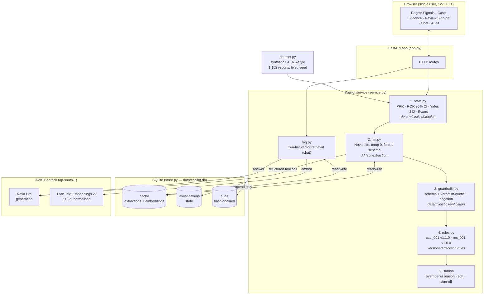
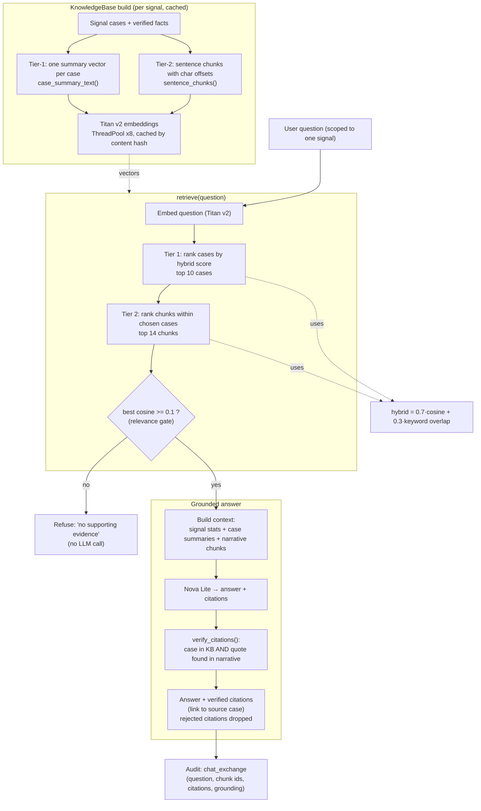
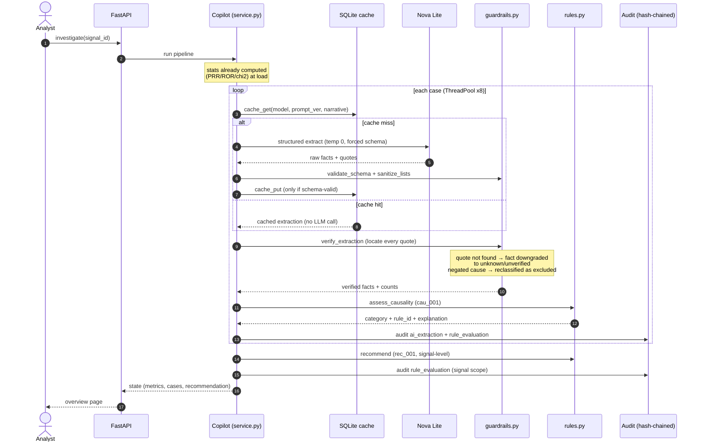
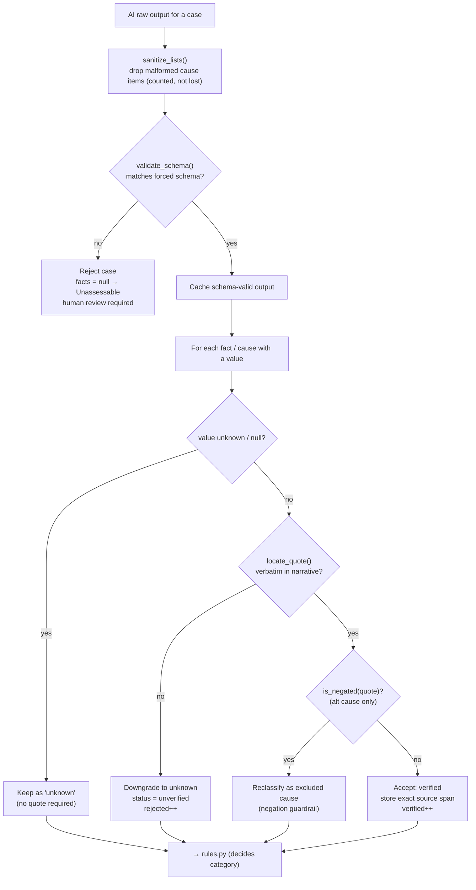
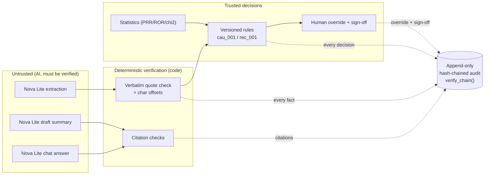

# Architecture — AI Signal Investigation Copilot

> **The idea in one line:** Statistics detect, AI extracts, code verifies, rules decide, a human approves. The AI never makes a regulatory decision. It only reads text and reports facts with quotes, and plain code checks those quotes.

These diagrams describe the prototype as built (FastAPI + SQLite + AWS Bedrock, Nova Lite + Titan v2).

---

## 1. High-Level System Architecture

Component view: the browser talks to a FastAPI app, which drives one `Copilot` service over five deterministic/AI stages, backed by SQLite (cache + state + hash-chained audit) and AWS Bedrock (Nova Lite for generation, Titan v2 for embeddings).

---

## 2. Data Retrieval Architecture (RAG)

The chat is scoped to a single signal's cases. Retrieval is **two-tier**: summary vectors first pick the most relevant *cases*, then chunk (sentence) vectors inside those cases pick the *evidence*. A hybrid score mixes cosine similarity with keyword overlap, a relevance gate refuses to answer when nothing is similar enough, and every citation the model returns is re-checked against the source narrative before it is shown.

---

## 3. Investigation Pipeline (per-case sequence)

How a single "investigate this signal" request flows through the five stages, including the extraction cache (replay needs zero LLM calls) and the guardrail downgrade path.

---

## 4. Guardrail / Verification Decision Flow

The deterministic gate the model cannot argue past. Every AI-stated fact must resolve to a verbatim quote at real character offsets in the source, or it is downgraded and counted as rejected.

---

## 5. Trust & Audit Model (who is allowed to decide)

Shows the trust boundary: AI outputs are treated as untrusted until verified by code; only deterministic rules and the human produce decisions; everything is written to an append-only hash-chained log.

---

### Key technical facts referenced above
- **Models:** Nova Lite (`apac.amazon.nova-lite-v1:0`) at temperature 0 with a forced tool schema; Titan Text Embeddings v2 (512-d, L2-normalised), region `ap-south-1`.
- **RAG constants:** top 10 cases, top 14 chunks, relevance gate at cosine ≥ 0.1, hybrid weight 0.3 lexical / 0.7 cosine.
- **Persistence:** SQLite (`data/copilot.db`) — content-hash cache (replay = zero LLM calls), investigation state, append-only hash-chained audit with `verify_chain()`.
- **Rules:** `cau_001 v1.1.0` (WHO-UMC-inspired causality), `rec_001 v1.0.0` (signal recommendation) — versioned and fully deterministic.
